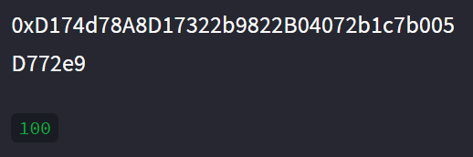
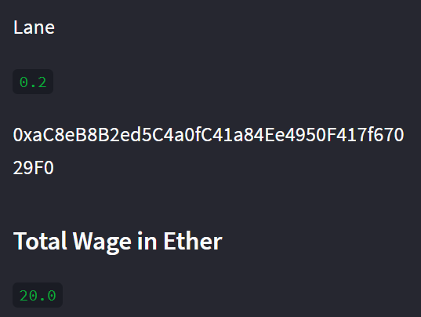
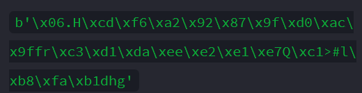
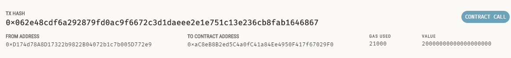

# Fintech Finder
Fintech Finder is an application that its customers can use to find fintech professionals from among a list of candidates, hire them, and pay them.This integrates the Ethereum blockchain network into the application to enable instant payments to the fintech professionals with cryptocurrency.

# Instructions
   1. Import Ethereum transaction functions into the KryptoJobs2Go application.
   
   2. Sign and run a payment transaction.

   3. Inspect the transaction in Ganache.

# Transaction Info:

## Client Account & Balance:

## Fintech Professional Wage Rate and address:

# Validation Hash:

## Contributors
> Email: Henrydate1@gmail.com |
> [GitHub](https://github.com/henrydate) |
> [LinkedIn](https://www.linkedin.com/in/henry-date-9356351a4/)

---
